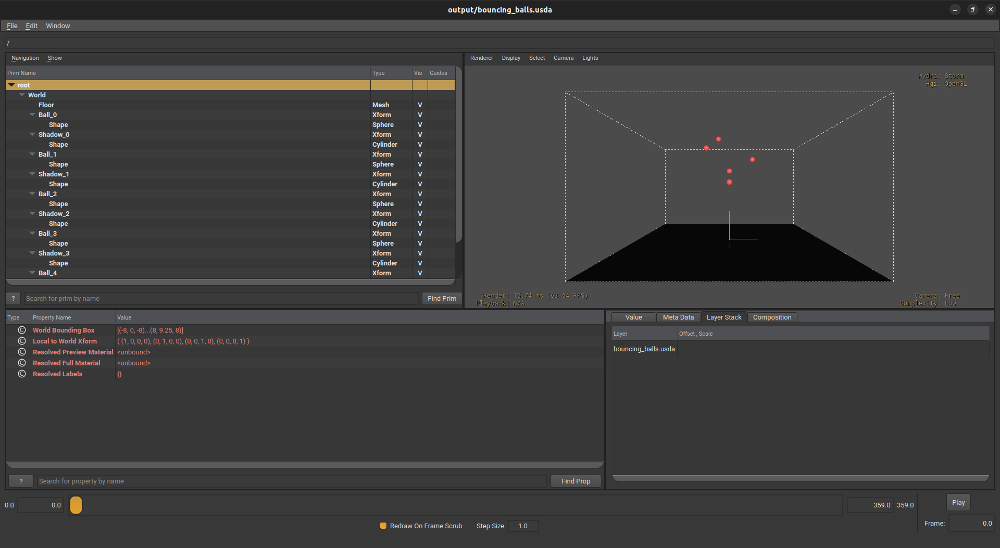
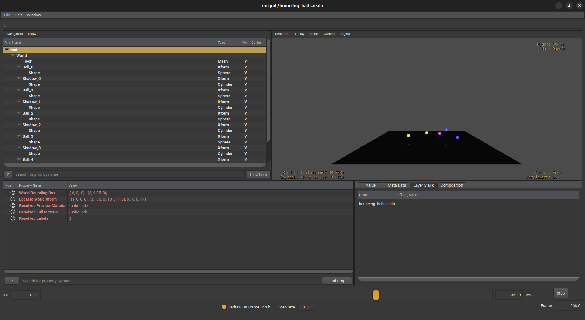
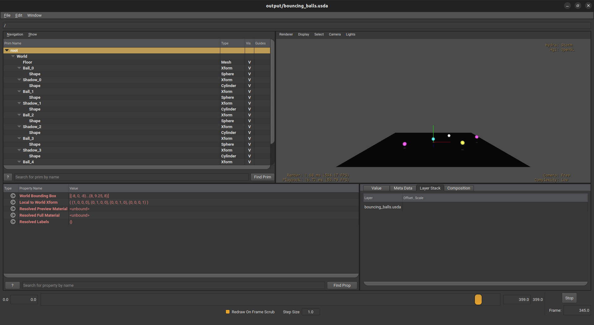

# Bouncing Ball Simulation

Multiple balls bouncing with physics using **Isaac Warp** and **OpenUSD**.

## Features
- 5 balls with different starting positions and throws
- Realistic gravity and bounce physics (Warp kernels)
- Ball color changes on each bounce
- Dynamic shadows on the floor
- Horizontal movement (thrown balls)

## How to Run
```bash
pip install warp-lang usd-core numpy
python3 main.py
usdview output/bouncing_balls.usda
```

Press `4` to remove wireframe, then click Play.

## Project Structure

- `config.py` - All settings (gravity, bounce, ball count)
- `physics.py` - Warp kernel for ball physics
- `scene.py` - USD scene with balls, shadows, colors
- `main.py` - Runs simulation

## Screenshots

### Start (balls dropping)


### Mid (balls bouncing)


### End (balls settling)

